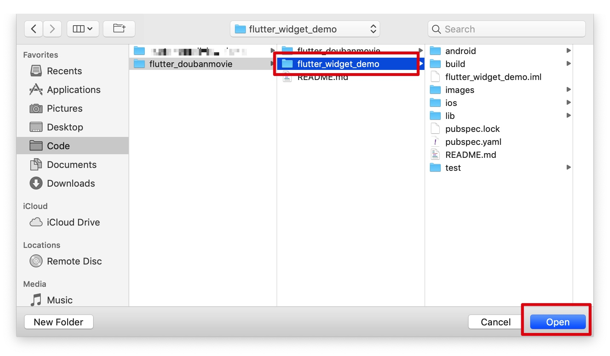
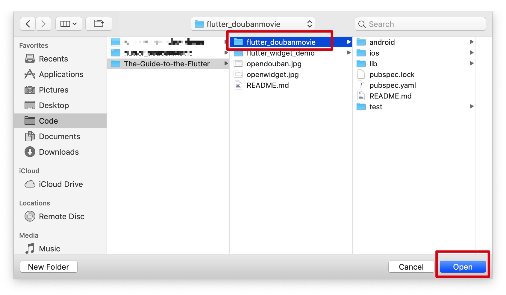

# Flutter 完全手册

这里是 Flutter 完全手册 里的代码。

## flutter_widget_demo 

flutter_widget_demo目录下的 Flutter 工程是手册里介绍 Widget 使用的 Demo 代码

#### 使用方法

在VS Code 中，打开本目录下的工程即可。

1. `File` -> `Open`

2. 选中 flutter_widget_demo 目录，然后点击 `Open`

   

####  注意事项

 Demo 代码里都有 `main()` 方法 和 `MaterialApp` ，主要是为了方便读者复制代码，在自己的独立 Flutter APP 里运行，在实际开发 APP 过程中，不会这样子开发。

想要知道 Flutter APP 实际如何开发，请看 `Flutter实战篇`。

## flutter_doubanmovie 

flutter_doubanmovie目录下的 Flutter 工程是 Flutter 实战里仿写的豆瓣电影的代码。

#### 使用方法

在VS Code 中，打开本目录下的工程即可。

1. `File` -> `Open`

2. 选中 flutter_doubanmovie 目录，然后点击 `Open`

   